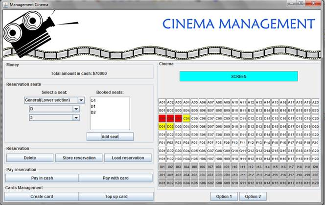

# Problem Description

## Case study Cinema

A cinema or movie theater is composed of seats that are identified with a character
that represents the row (A-K) and a number of seat(1-20). The seats can be of two
types, preferential, also called upper seats (rows I, J and K) and general, also
called lower seats (remaining rows). The preferential or upper seats have a cost of
$11.000 and the general or lower seats a cost of $8.000. In the image that appears
in the bottom of this document it is easy to watch such structure (preferential
and general). Also, it is shown the graphical user interface that was designed
for this application.

The cinema provides a reservation service to its customers with the CARDCINEMA
card, which is a prepaid card that is offered by the cinema so that the customers
can book tickets, and also get a 10% discount at the moment of the payment.
The reservation service works like this: A customer can call and ask for booking
a set of seats under his card's name, and such seats will be paid off before the
movie starts. The payment of the reservation can be made either with the same
card of the same customer or with another one.

Due to some policies of the cinema, the number of the CARDCINEMA card must be
the same number of the customer's identification. The CARDCINEMA card is acquired
with an initial balance of $70.000 and can be topped up with an amount of $50.000,
as many times as is desired.

# GUI

